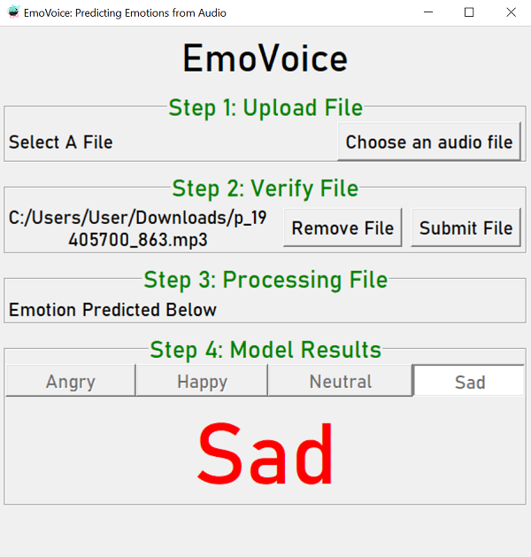

# Academic Year 2023/2024 Semester 2
**IS4242 Group 3**

## EmoVoice: Human Voice Emotion Recognition

## Initial Setup
1. Run `pip install -r requirements.txt` in command prompt
2. Run the command `mlflow ui --port 5001` in command prompt to start mlflow on localhost
3. Run `initialModelTraining.py` to create and store the model on mlflow

## To run the application to predict audio
1. Run the command `mlflow ui --port 5001` in command prompt to start mlflow on localhost (if it has not already been started)
2. Run the Python file `tkinter_frontend.py`
3. Follow the steps in the tkinter UI to upload, submit, and review model predictions.

Note: Supported audio file formats are `.wav`, `.mp3`, `.ogg`

## Code Structure
- `data` folder contains audio data used in the project
- `Notebooks` folder contains notebooks that were used for our exploration, EDA, feature engineering, and other purposes. 
- `Presentation Samples` folder contains audio clips that were selected to be used in our demonstration. It consists of recordings from the 5 of us, as well as some recordings from our friends (whose voices were not used in our training data at all).
- `readme_resources` folder contains the screenshots that are used in this readme.
- `dataML.py` is the Python file containing the class that processes the audio clip obtained by our frontend. It has the following flow:
    - Process audio file into input data containing only selected processed features
    - Predicts the above data by retrieving and using the Random Forest model stored in MLFlow
- `initialModelTraining.py` is the Python file that trains the initial Random Forest model and loads it into MLFlow. It has the following flow:
    - Load `IS4242 Data.csv` that has been generated by `Feature_selection.ipynb`
    - Train the Random Forest Classifier and store the model in MLFlow (the folders `mlartifacts` and `mlruns` may be created by MLFlow to store the model and run information, please do not delete them!)
    - Print training metrics
- `tkinter_frontend.py` is the Python file containing the class that creates the frontend used. It makes use of a DataML object using `dataML.py` to assist with predicting the user audio.

## Other Miscellaneous Items

### Manually checking model training performance
1. Go to `localhost:5001` on your browser
2. Under `Experiments` >> `Training - Audio Emotion Predictor`, select the only model.

3. The model parameter and metrics are displayed here. You can view the model metrics and artifacts by clicking on the tabs on the top.

### Manually checking predictions
1. Go to `localhost:5001` on your browser
2. Under `Experiments` >> `Predictions - Audio Emotion Predictor`, pick the run you are interested in.

3. The prediction is stored as the metric `Prediction`. The following is the mapping: {"angry": 1, "happy": 2, "neutral": 3, "sad": 4}.

